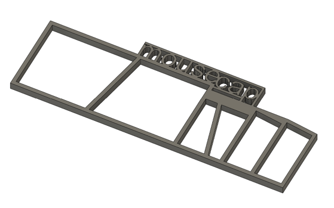

.. _assembly-mouse-cap:

Mouse cap
=========================

.. figure:: ../../../_static/images/mouse_cap_parts.png
    :alt: Mouse cap parts
	:height: 300px

    Mouse cap components. 

3Dneuro/Open Ephys ship the mouse cap pre-tapped and with the 3D printed parts screwed together. All other components are included (metal pins, copper mesh), as well as a stencil for cutting the copper mesh to dimension. For convenience, we provide metal pins of 3 different lengths: 30 mm (*2), 12 mm (*4) and 20 mm (*4). The use of the 30 and 12 mm pins is described in the reference protocol below. The 20 mm pins are not part of the mouse cap, stricly speaking. But they can be used to loosely connect the left and right walls to the base at the start of the surgery, and can be used flexibly to construct the implant by soldering those pins to the 30 mm pins (e.g. creating an anchoring point for the electrode connector).   

   Mouse cap stencil.

Among the R2 system, this design requires the most assembly by the user, as the header pins and copper mesh need to be connected to the 3D printed parts. To complete the remaining assembly steps, or to source the parts yourself and assemble from scratch, the reference protocol is `here <https://buzsakilab.github.io/3d_print_designs/capsystems/mouse_cap/>`__.  

