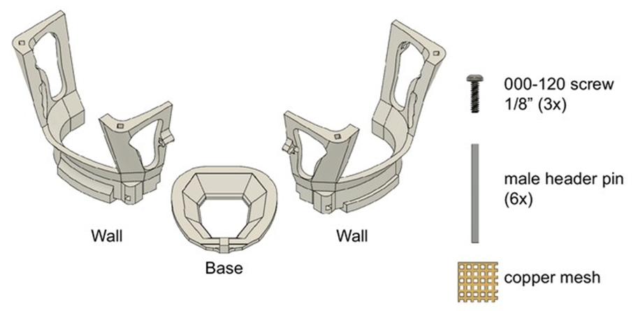

Assembly guide: Mouse cap
=========================

    Mouse cap components. 

3Dneuro/Open Ephys ship the mouse cap pre-tapped and with the 3D-printed parts screwed together. All other components are included (metal pins, copper mesh), as well as a stencil for cutting the copper mesh to dimension.  

.. figure:: ../../../_static/images/mouse_cap_stencil.png
   :alt: Mouse cap stencil
   :height: 200px

   Mouse cap stencil.

Among the R2 system, this design requires the most assembly by the user, as the header pins and copper mesh need to be connected to the 3D-printed parts. To complete the remaining assembly steps, or to source the parts yourself and assemble from scratch, the reference protocol is `here <https://buzsakilab.github.io/3d_print_designs/capsystems/mouse_cap/>`__.  

