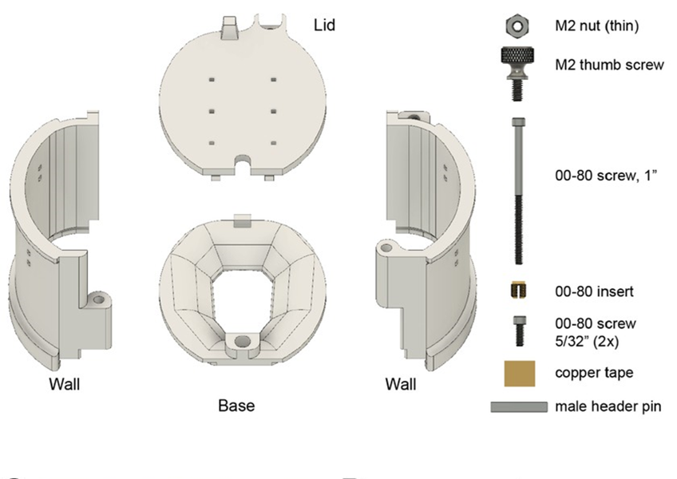

Assembly guide: Rat cap
========================

3Dneuro/Open Ephys ship the rat cap pre-assembled. Partial disassembly will be necessary for the implant surgery. 

Copper tape (for electric shielding) and metal pins (to solder connectors) are included: Adding them to the rat cap is optional. For the metal pins, most users will need them as an anchor point for probe connectors, however their placement may vary across users. To do these steps, partially disassembling the rat cap will be necessary: First, remove the lid, then carefully unfasten the two 00-80 screws that connect the walls. This should provide sufficient space for applying the tape, inserting and gluing the metal bars (steps 4 and 5 in assembly protocol found `here <https://buzsakilab.github.io/3d_print_designs/capsystems/rat_cap/>`__)). 

For sourcing and assembling the rat cap yourself, the reference protocol is `here <https://buzsakilab.github.io/3d_print_designs/capsystems/rat_cap/>`__. 