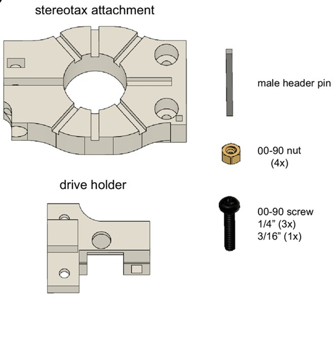
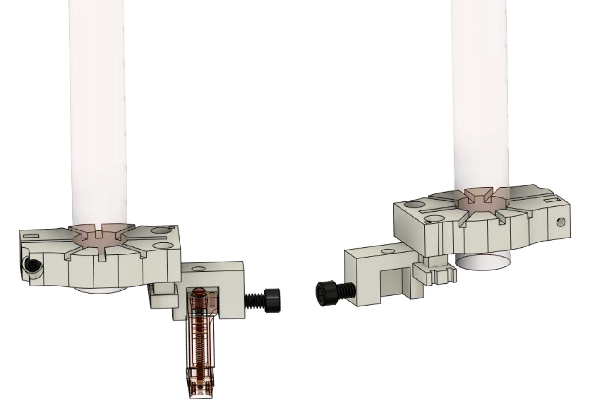

.. _assembly-implantation-holders:

R2 implantation holders
=======================================

.. _assembly-implantation-holders-plastic:

Original holder (plastic)
^^^^^^^^^^^^^^^^^^^^^^^^^

   Components of the R2 holder and stereotax attachment.

3Dneuro/Open Ephys ship the plastic holder and stereotax attachment fully assembled. We also provide two *mirrored* versions of the holder, allowing the user to choose how they distribute the working space during the implantation surgery. It may also help right-handed and left-handed users to work in their preferred configuration (see figure below). 

   
   Two configurations of the implantation setup enabled by the mirrored holders.  

For sourcing parts and assembling the design yourself, the reference protocol is the `Buzsaki lab's GitHub page <https://buzsakilab.github.io/3d_print_designs/microdrives/metal-microdrive/>`__.

.. _assembly-implantation-holder-metal:

Metal holder and storage box
^^^^^^^^^^^^^^^^^^^^^^^^^^^^

.. note::

   To overcome some limitations of the original 3D printed holder, 3Dneuro is currently finalizing the development of a metal holder with a smaller footprint and improved holding stability.
