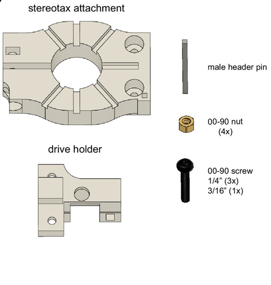
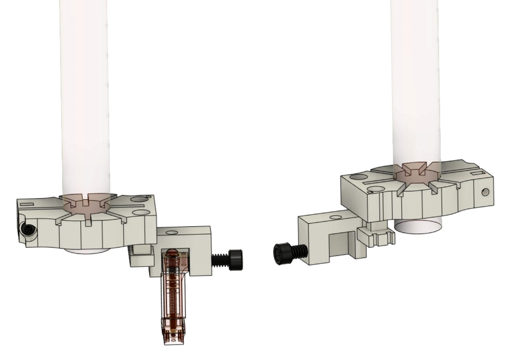

.. _assembly-implantation-holders:

R2 implantation holders
=======================================

.. _assembly-implantation-holder-metal:

Metal implantation system
^^^^^^^^^^^^^^^^^^^^^^^^^

The R2metal system ships fully assembled: there is nothing to put together. Unpack it and check that the pack contains the parts below.

.. figure:: ../../_static/images/r2metal/r2metal_B1_kit_v2.png
   :width: 100%
   :alt: Contents of the R2 metal implantation system: case lid, assembly and storage case, metal holder, rod support block, 1.5 mm and 2.5 mm hex drivers, stereotactic adapter.

.. list-table::
   :header-rows: 1
   :widths: 30 70

   * - Part
     - Comes assembled with
   * - Case base
     - Connector basket, basket rod and panel screw; removable window on the back
   * - Case lid
     - Two captive panel screws
   * - Metal holder
     - Wedge clamp, dowel pins, clamp screw (M2) and M3 panel screw
   * - Rod support block (blue)
     - Loose part
   * - Stereotactic adapter
     - Blue sleeve with set screw, thin steel rod and connector basket
   * - Hex drivers
     - 1.5 mm hex driver and a second hex driver

.. note::

   For shipping only, the blue rod support block is placed on a transparent shipping bracket in the case. Remove shipping bracket and block before use and store them separately. Having them in the case while using it with a probe can damage the probe!

.. note::

   The R2drive or R2rail and the probe are not part of the pack.

.. tip::

   Before the first surgery, clean and sterilise the metal parts as described in :ref:`user-manual-metal-cleaning`.

To adapt the connector baskets to your probe, see :ref:`assembly-metal-basket-customization`.

.. _assembly-implantation-holders-plastic:

Original holder (plastic)
^^^^^^^^^^^^^^^^^^^^^^^^^

   Components of the R2 holder and stereotax attachment.

3Dneuro/Open Ephys ship the plastic holder and stereotax attachment fully assembled. We also provide two *mirrored* versions of the holder, allowing the user to choose how they distribute the working space during the implantation surgery. It may also help right-handed and left-handed users to work in their preferred configuration (see figure below). 

   
   Two configurations of the implantation setup enabled by the mirrored holders.  

For sourcing parts and assembling the design yourself, the reference protocol is the `Buzsaki lab's GitHub page <https://buzsakilab.github.io/3d_print_designs/microdrives/metal-microdrive/>`__.

.. toctree::
   :hidden:
   :maxdepth: 2
   :titlesonly:

   basket_customization/index
