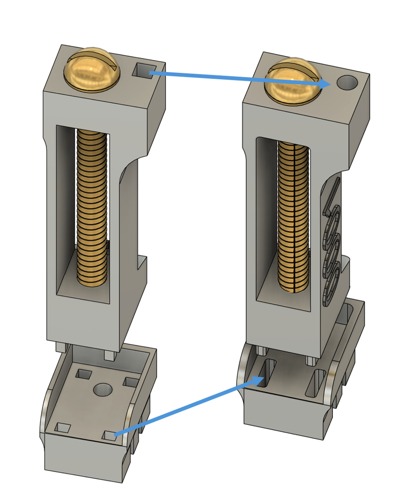

.. _assembly-R2drive:

R2drive S/L
===========================

3Dneuro/Open Ephys ship the R2drive fully assembled, with an individual serial number. Therefore, no assembly of the drive is required.

The R2drive is manufactured differently than the original 3D printed design (see table below). 

  
.. list-table::
   :widths: 25 25 25 25
   :header-rows: 1

   * - 
     - Material
     - Manufacturing process
     - Method to secure the driving screw
   * - *3Dneuro/Open Ephys*
     - Aluminium
     - Micromachining (`CNC <https://en.wikipedia.org/wiki/Computer_numerical_control>`__ and `EDM <https://en.wikipedia.org/wiki/Electrical_discharge_machining>`__)
     - Welding
   * - *Vöröslakos et al. 2021*
     - Stainless steel
     - 3D printing (`SLS <https://en.wikipedia.org/wiki/Selective_laser_sintering>`__)
     - Soldering

As a result, the 3Dneuro/Open Ephys drives are half the weight due to the material, but cannot be disassembled easily due to the welding (soldering can be reversible for this type of application).

For sourcing and assembling the original design, the reference protocol is the `Buzsaki lab's GitHub page <https://buzsakilab.github.io/3d_print_designs/microdrives/metal-microdrive/>`__. 

.. tip:: 
   The shuttle design was updated after most of the figures for the `paper <https://elifesciences.org/articles/65859>`__ were finalized (specifically, Fig 1A-C; Fig 3—figure supplement 1). Therefore, the shuttle design seen on those figures is outdated and can be ignored. The updated design is called v9 on GitHub, and is the one you will see in every assembly instruction or video. 

There are additional design differences between the 3Dneuro/Open Ephys version and the `Vöröslakos et al. <https://doi.org/10.7554/eLife.65859>`__ version, due to the choice of machining for manufacturing the parts. The metal microdrive consists of three main parts: A drive body, a movable arm that we often call the shuttle, and a removable base.

   Comparison of both designs. Left: 3D printed, Right: Machined. 

In the 3Dneuro/Open Ephys version:

* The drive body to base connection was modified. From 4 connecting feet in square shape (see picture) to 2 longer rounder feet.  
* On the drive body, the square-shaped hole that fits a male header pin was changed into a round shape. 
   
.. warning::
   Parts are not compatible across designs. For example, a machined base cannot be used with a 3D printed drive body and vice versa.  

