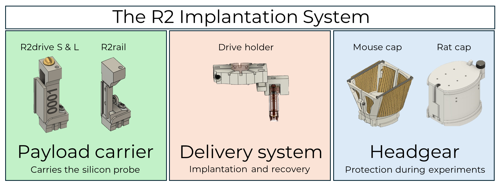
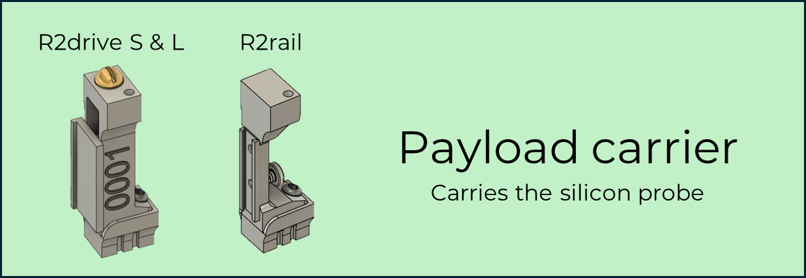
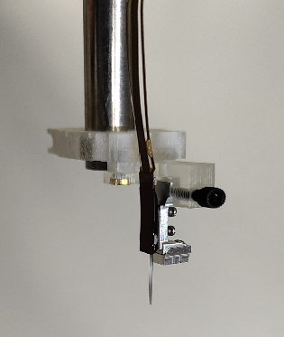
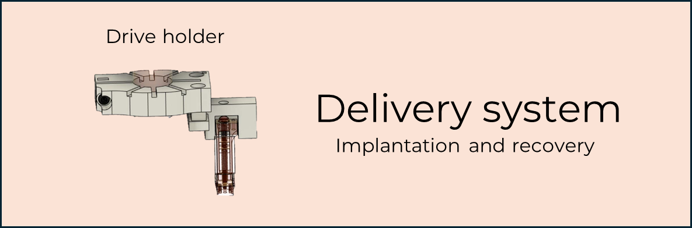
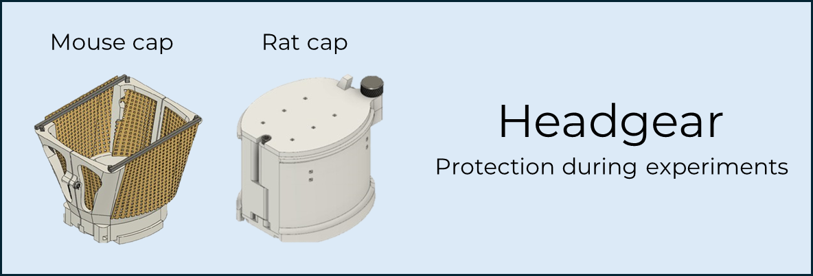

.. _getting-started:

Getting Started
===============

The **R2 system** is a set of open source tools for chronic extracellular recordings in small animals (such as mice, rats, lizards, etc.) with silicon probes. It is designed to maximize the probe recovery rate and the number of times a probe can be used.

The R2 system is an complete and integrated set of tools that includes:

* Several 'payload carriers' for mounting a wide array of silicon probes (e.g. `Neuropixels <https://www.neuropixels.org/>`__, `Neuronexus <https://www.neuronexus.com/>`__, `Cambridge NeuroTech <https://www.cambridgeneurotech.com/>`__, `ATLAS Neuro <https://www.atlasneuro.com/>`__, `DBC <https://diagnosticbiochips.com/>`__),
* A payload delivery system made of tools for probe preparation, implantation, and recovery,
* Protective scaffolding, called headgear, to protect the probes mechanically and to reduce electrical noise during recordings.

   Overview of the R2 Implantation System. Images in this and the following illustrations are partially modified from [#f1]_, under CC BY 4.0 license.

Below we go into the details of each component of the R2 system.

.. _getting-started-payload-carrier:

1. Payload carrier - Microdrives & microrails
~~~~~~~~~~~~~~~~~~~~~~~~~~~~~~~~~~~~~~~~~~~~~

The *R2drives* are classic *microdrives* that hold the silicon probes, and include a mechanism to move the probes up and down for adjusting recording depth.

The *R2rail* is a new type of payload carrier - that in line with the well-established microdrive term we call *microrail* - which was designed for Neuropixels 2.0 probes with a metal cap. R2rail features a dovetail mechanism to which the Neuropixels 2.0 probe can be mounted directly. The R2rail does not allow for adjustment of the recording depth after mounting. As the recording sites on Neuropixels probes span a wide part of the probe shanks, this is often not necessary.

.. note::  
    While the R2rail can be used interchangeably with the R2drive, it does not possess a drive mechanism. Please make sure that you are using an R2drive when adjusting probe depth post-implantation is required for your use case\!

.. _getting-started-r2drive:

R2drive S & L
^^^^^^^^^^^^^

The R2drive comes in two variants, the R2drive S and the R2drive L. They differ mainly in the size of the moveable arm (for details, see :ref:`Two versions`). The R2drive S is appropriate for most probes, while the R2drive L is designed for larger probes, such as the Neuropixels 1.0 probes.

The R2drive consists of two main parts: The drive body and the detachable base. 

* The drive body is a metal frame that contains a screw mechanism to move the arm up and down along the long axis of the body. 
* The drive body is mounted on a detachable base using a screw. When implanting an R2drive, only the base is fixed to the skull, while the drive body remains free of adhesives. This allows for easy removal of the R2drive body-silicon probe assembly at the end of an experiment by unscrewing the drive body from the base. 

As a result, this system facilitates the safe recovery of expensive probes and lets experienced researchers reuse the same R2drive body-silicon probe assembly for up to 3-5 times.

For more information on the R2drive S and L, see :doc:`the user manual for the R2drive</user_manual/r2drive_sl/index>`.

.. _getting-started-r2rail:

R2rail
^^^^^^

The R2rail is a new type of payload carrier that is designed to be used with Neuropixels 2.0 probes with a metal cap. 
It features a micromachined dovetail rail on which the metal cap can be easily mounted. This makes glueing the probe to the microdrive obsolete 
and allows attaching the probe to the microdrive safely by hand, with only a screwdriver, in less than a minute. 
The micromachined rails ensure perfect alignment of the probes to the R2rail.

For more information on the R2rail, see :doc:`the user manual for the R2rail</user_manual/r2rail/index>`.

.. _getting-started-payload-delivery-system:

2. Payload delivery system
~~~~~~~~~~~~~~~~~~~~~~~~~~

This component of the R2 system includes surgery holders and adapter parts to connect to a stereotactic frame. 

Surgery holders allow the handling of the payload carrier/probe assembly during both implantation and explantation. That includes a system for managing the flex cable and preamplifier board that are attached to the probe. This is a key feature, because besides the probe shanks, damage to the flex cable is a major reason for probe breakage.  

The original design for an implantation holder and stereotaxic adapter consists of 3D printed plastic parts. A new version in metal is under development. 

For more information on the holders, see :doc:`the user manual</user_manual/implantation_holders/index>`.

.. _getting-started-headgear:

3. Headgear
~~~~~~~~~~~

The most fragile parts of an implant are the silicon probe shanks and flex cables. To protect them, the R2 system uses dedicated headgear for each implant. 

The headgear serves multiple purposes:

* it protects the probes from mechanical damage during the experiment
* it can include conductive shielding to reduce electromagnetic noise in the electrophysiological recordings
* decoupling the headgear from the payload carrier allows the flexible placement of multiple R2drives and/or R2rails on the same implant without the need to redesign the implant
* decoupling the headgear from the microdrive allows for easier and more successful recovery of the payload carrier-probe assembly than an integrated system

The R2 system includes multiple headgear designs for different use cases:

* :doc:`Rat cap </user_manual/headgear/rat_cap/index>` for freely moving rats
* :doc:`Mouse cap </user_manual/headgear/mouse_cap/index>` for freely moving mice
* Other headgear designs, e.g., 3Dneuro crown, DREAM implant, and custom solutions

For more information on the headgear, see :doc:`the user manual</user_manual/headgear/index>`.

.. _getting-started-references:

References
~~~~~~~~~~~
.. [#f1] Mihály Vöröslakos, Peter C Petersen, Balázs Vöröslakos, György Buzsáki (2021) Metal microdrive and head cap system for silicon probe recovery in freely moving rodent. eLife 10:e65859. `https://doi.org/10.7554/eLife.65859 <https://doi.org/10.7554/eLife.65859>`__
