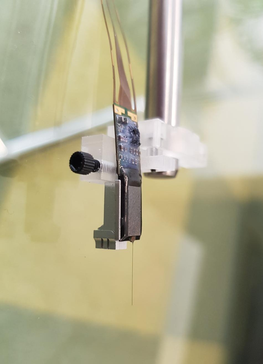

.. title:: R2 Implantation System

=======================
R2 Implantation System
=======================

The **R2 system** is an open-source implantation system for silicon probes. R2 stands for Recover and Reuse those silicon probes, on average for 3 chronic experiments. This defining feature is enabled by sacrificing the lower end of the implant during explantation. As a result, the expensive payload is safely recovered while the inexpensive, replaceable part can be disposed of.
    

Components
~~~~~~~~~~

* A payload carrier, with or without a drive mechanism,
* A surgery holder for implant-/explant-ation,
* Headgear to protect the implant in freely moving animals (versions for mice and rats).

Key features
~~~~~~~~~~~~

* Compatibility with almost any chronic silicon probe (including Neuropixels)  
* Metal parts ensure performance and durability for key steps such as probe recovery
* Probe recovery rate 70-80% initially, 100% with experience; Probe reuse 3+ times, until the impedance degrades
* Ability to move the probe post-implantation with microdrive \- 7mm travel distance  
* Lightweight: Microdrive \= 0.47g; Mouse cap \= 2.2g; Rat cap \= 11g  
* Components form a fully integrated system but can be used independently  
* Extensive documentation, with 4 published protocols 

R2drive stands out by the abundance of protocols available in peer-reviewed journals, which reflect its continuous development. In addition to the original methods paper by `Vöröslakos et al. <https://doi.org/10.7554/eLife.65859>`__, the `Buzsaki lab <https://buzsakilab.com/wp/>`__ at NYU also published further protocols that describe the use of a `base plate system <https://doi.org/10.21769/BioProtoc.4137>`__ and of `μLED probes for optogenetic perturbation <https://doi.org/10.1016/j.xpro.2023.102570>`__. 3Dneuro participated in the design of `a novel head-fixation and headgear system <https://doi.org/10.3791/66867>`__, and is continuously improving the design and manufacturing process based on user feedback. Several research papers using the R2 system have already been published (e.g. `Huszár et al. 2022 <https://www.nature.com/articles/s41593-022-01138-x>`__, `Watkins de Jong et al. 2023 <https://www.sciencedirect.com/science/article/abs/pii/S0960982223003202>`__, `Soula et al. 2023 <https://www.pnas.org/doi/10.1073/pnas.2302676120>`__, `Ye et al 2024 <https://www.biorxiv.org/content/10.1101/2023.08.23.554527v3>`__). 

.. important::

    When using the R2 System, please cite the following paper:  
    
    Mihály Vöröslakos, Peter C Petersen, Balázs Vöröslakos, György Buzsáki (2021)
    Metal microdrive and head cap system for silicon probe recovery in freely moving rodent eLife 10:e65859.
    https://doi.org/10.7554/eLife.65859

    `download BIBTEX <https://elifesciences.org/articles/65859.bib>`__
    `download RIS <https://elifesciences.org/articles/65859.ris>`__

    Please also consider mentioning 3Dneuro in your methods section as the supplier of the R2 system.

.. raw:: html
    

  

        <a class="reference internal" href="getting_started/index.html">
            
                

                    
                    

                        <h5 class="card-title">Getting Started</h5>
                        
How to get started with the R2 system

                    

                

            
        </a>
        
        <a class="reference internal" href="user_manual/index.html">
            
                

                    
                    

                        <h5 class="card-title">User Manual</h5>
                        
Complete guide to using the R2 system

                    

                

            
        </a>
        
        <a class="reference internal" href="assembly_guide/index.html">
            
                

                    
                    

                        <h5 class="card-title">Assembly Guide</h5>
                        
Step-by-step assembly instructions

                    

                

            
        </a>
        
        <a class="reference external" href="https://3dneuro.com/quote" target="_blank" rel="noopener noreferrer">
            
                

                    
                    

                        <h5 class="card-title">Buy Parts</h5>
                        
Order from 3Dneuro.com

                    

                

            
        </a>
        
    

.. toctree::
   :hidden:
   :maxdepth: 2
   :titlesonly:

   getting_started/index
   user_manual/index
   assembly_guide/index

