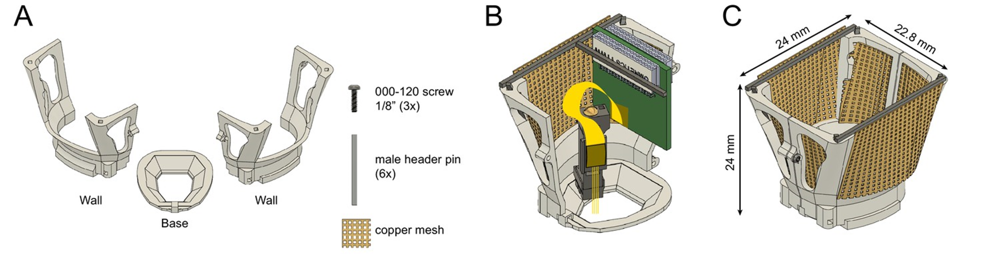

User manual: Mouse cap
=======================

The fully assembled mouse cap weighs 2.2 g. To prepare your mouse cap, see :doc:`assembly guide</assembly_guide/headgear/mouse_cap/index>`.

   **A** Components of the mouse cap. 
   **B** Illustration of how the probe connector can be secured to the mouse cap. 
   **C** Assembled mouse cap with copper mesh, without  drive-probe assembly or connector. 
   Image modified from `eLife article <https://elifesciences.org/articles/65859#fig2>`__, under CC BY 4.0 license.

For implantation, the base is first attached to the skull using dental cement (Metabond). 
It does not require skull screws, making it minimally invasive. 
As shown in the above schematic (source: `Fig 2B <https://elifesciences.org/articles/65859#fig2>`__), 
one wall can be attached to the base and serve as frame for attaching the connector 

