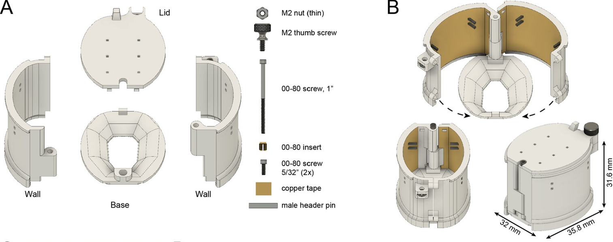

User manual: Rat cap
=====================

The 3D-printed parts making up the rat cap weigh 8.3 g. With metal screws, copper tape and pins, the rat cap weighs about 11 g.  

   **A** Components of the rat cap. 
   **B** Assembled rat cap (without R2drive or probes) and illustration of the closing mechanism.
   Modified from `eLife article <https://elifesciences.org/articles/65859#fig3>`__, under CC-BY 4.0 license.

The base is first attached to the skull using dental cement (Metabond). It does not require skull screws, making it minimally invasive. For the steps to finish assembling the rat cap during surgery, see `Figure 3 - video 2 <https://elifesciences.org/articles/65859/figures#fig3video2>`__.

