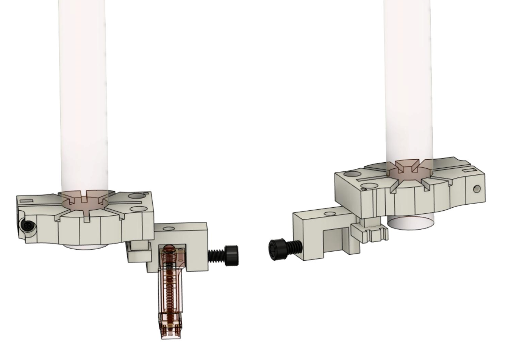

.. _user-manual-implantation-holders:

R2 implantation holders
=====================================

.. _user-manual-implantation-holders-plastic:

3D printed holder (plastic)
---------------------------

The plastic holder comes fully pre-assembled and ready to use. Through the stereotax adapter, the holder can be connected to common stereotactic devices by fastening it to the 8mm rod of the stereotactic arm.

   The 3D printed stereotax adapter and drive holder, assembled. 
   **Left:** Original design, with a shaded rendering of an R2drive S in the drive holder.
   **Right:** With mirrored version of the holder.

.. warning::

   When **fastening the nylon screw** that secures the R2drive or R2rail into the holder, excess pressure may result in breaking the holder. Before implanting, test the holder with an empty drive to get a sense of the sufficient level of fastening.

In addition to the original drive holder design, 3Dneuro ships by default a mirrored version of the drive holder (customer request), allowing you to choose the  one most appropriate for your implantation protocol. 

.. note::

   In the **mirrored drive holder version**, the plastic 00-56 screw that is holding the R2drive is pushing the microdrive towards the
   stereotax attachment. This might cause space issues when large probes are mounted on an R2drive L. When using the mirrored version
   of the holder with the R2drive L, always make sure the probes can be mounted in such a way that they do not collide with the stereotax attachment.

.. _user-manual-implantation-holders-metal:

Metal Implantation System
-----------------------------

To overcome some limitations of the original 3D printed holder, 3Dneuro developed a complete storange and implantation system to safely manage the full lifecycle of your probe after it has been attached to the R2drive/R2rail: Preparation, implantation, explantation, clean up, and storage. 

In includes a durable metal holder with a smaller footprint and improved holding stability. 

The key components are: 

* Metal holder (stainless steel)
* Probe storage and transfer case (aluminium base, 3D printed cover)
* Stereotactic adapter with 8 mm pole for implantation and explantation procedures (stainless steel)
* Connector management system (3D printed and metal parts), present both in the storage/transfer box and on the im-/ex-plantation pole. 

   

