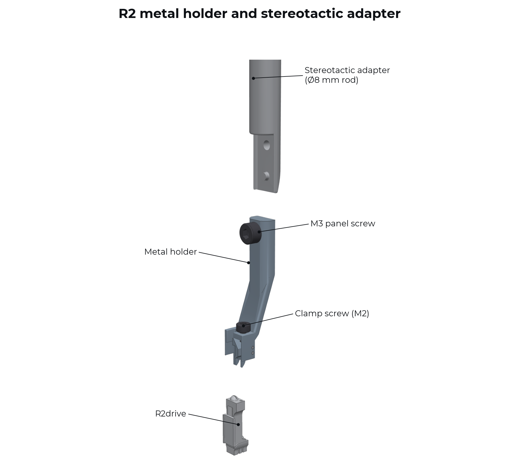
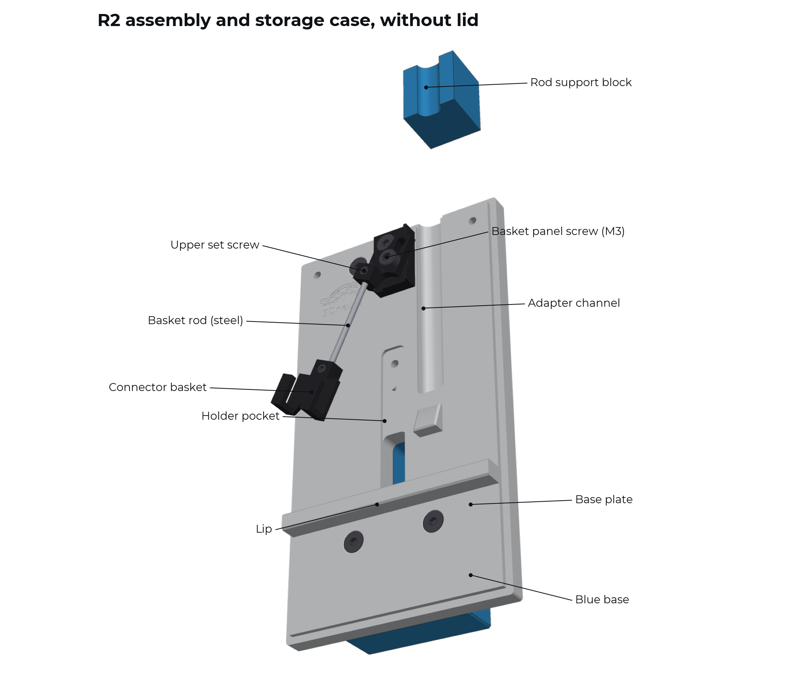
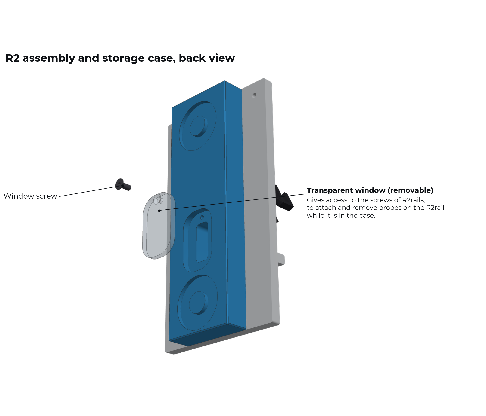

.. _user-manual-metal-components:

System components
=================

The system has three parts: the metal holder, the stereotactic adapter and the R2 assembly and storage case.

Metal holder
------------

The metal holder is micromachined from stainless steel. A miniaturized clamping mechanism allows stable holding of a `payload carrier <https://3dneuro.github.io/r2-docs/getting_started/index.html#payload-carrier-microdrives-microrails>`__ (R2drive or R2rail). An M3 panel screw fixes it either in the case or on the stereotactic adapter. The R2drive clamps into its lower end.

Stereotactic adapter
--------------------

The stereotactic adapter is an 8 mm stainless-steel rod that can be attached to most standard stereotactic frames in place of the standard electrode holder. The metal holder screws onto the milled tab at its lower end.

It carries its own connector basket, that can easily be adjusted in height to set the probe's flex-cable tension.

R2 assembly and storage case
----------------------------

The `R2 assembly and storage case <https://3dneuro.com/products/r2-case>`__ stores the holder with R2drive and probe, and can be used to attach your neural probes to the R2drive. The base is machined aluminium for stability and dimensional accuracy. The R2drive's base rests on the lip of the case, which aligns the drive with the case. This makes probe alignment easier and abolishes the need for holding the R2drive in an unstable third hand or vise while attaching the probe. Due to its weight, the case can rest stably on a lab bench for electrode attachment. The blue base is thinner than the top plate of the case on purpose, allowing it to be clamped in a vise as an alternative to handling it directly on a bench. When closed with the transparent lid, the case can also be stored upright, allowing you to easily display your probes on a shelf between experiments.

.. list-table::
   :header-rows: 1
   :widths: 30 70

   * - Feature
     - Function
   * - Lip
     - Stabilizes the R2drive base
   * - Holder pocket
     - Takes the metal holder, fixed with its M3 panel screw
   * - Adapter channel
     - Takes the lower end of the stereotactic adapter during transfer
   * - Connector basket
     - Holds the connector/EIB; swivels on the basket panel screw (M3)
   * - Upper set screw
     - Releases the steel basket rod to slide it and tension the flex cable
   * - Rod support block (blue)
     - Holds the 8 mm rod while its lower end lies in the case
   * - Lid
     - Closes with two spring-loaded captive panel screws

From the back, a removable transparent window gives access to the screws of R2rails. You can attach and remove probes on an R2rail while it stays in the case.

.. note::

   The transparent window is the main feature that is used differently for R2drives and R2rail. For R2drives, it can remain attached throughout. For R2rail, instead of glueing the probe to the R2rail, it is fixed by tightening a screw on the back of the R2rail. The removeable window allows doing this while the R2rail is attached to a R2 metal holder in a case.

.. _user-manual-metal-ordering:

Ordering
--------

.. list-table::
   :header-rows: 1
   :widths: 35 65

   * - Item
     - Contents
   * - R2 metal implantation system
     - Metal holder and stereotactic adapter; R2 assembly and storage case included with the first order
   * - Extra metal holder
     - Metal holder
   * - Extra stereotactic adapter
     - 8 mm rod with connector basket
   * - Extra R2 assembly and storage case
     - R2 assembly and storage case (without extra metal holder)

.. note::

   If you want to store multiple R2drives with probes at the same time, we recommend getting one extra holder and one extra case per R2drive + probe.
