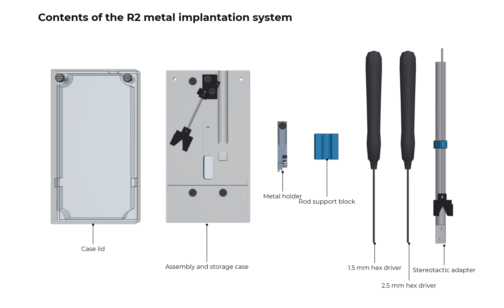
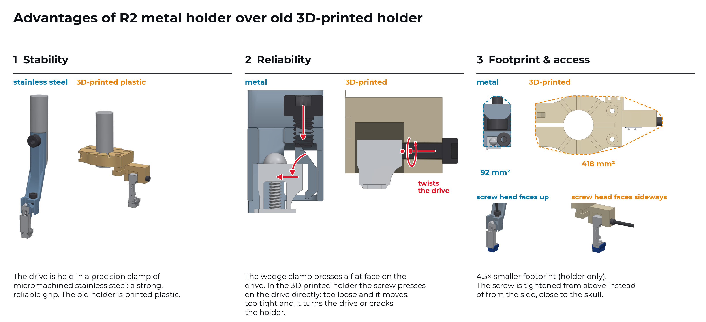
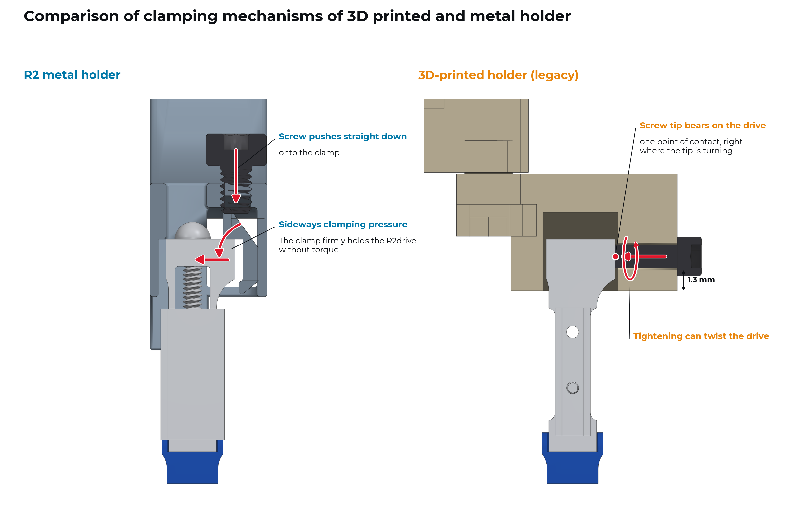
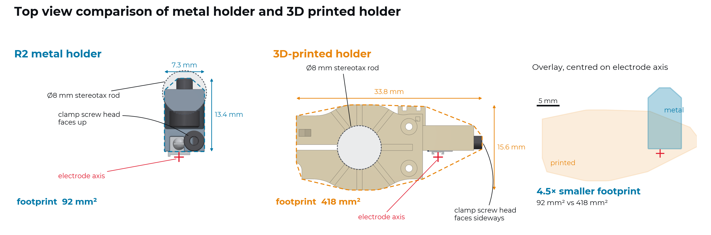
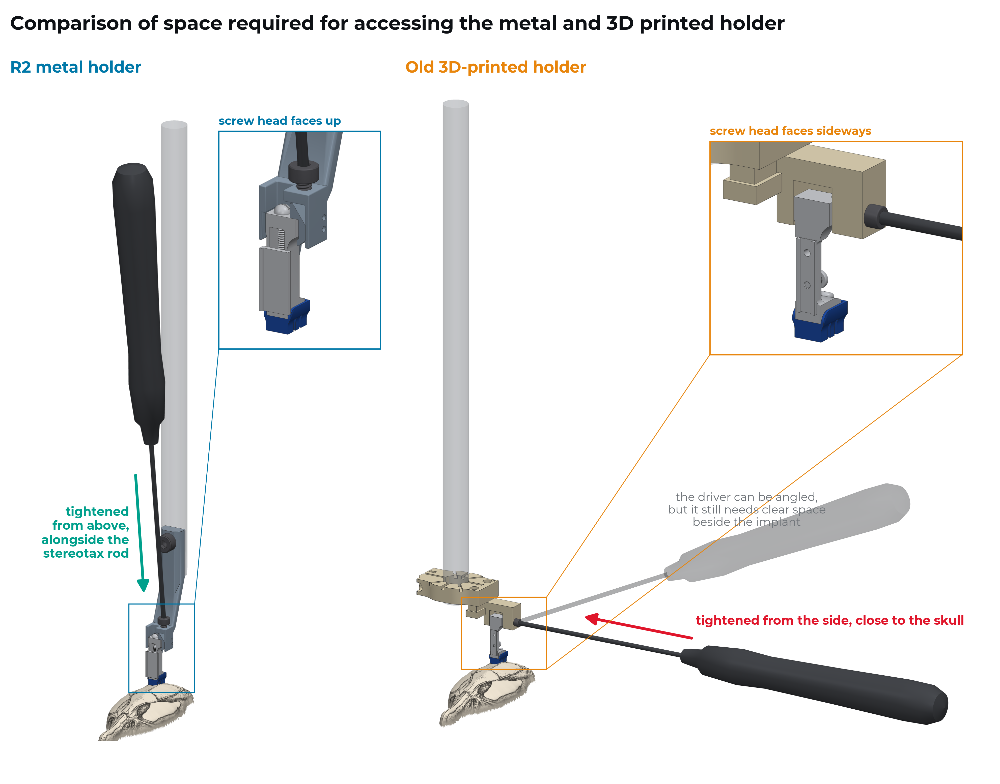

.. _user-manual-metal-system:

R2 metal implantation system
============================

The R2metal implantation system handles the full life of a probe once it is attached to an R2drive or R2rail: preparation, implantation, explantation, clean-up and storage. It also replaces the original 3D-printed holder and is the recommended way to implant R2 drives.

.. admonition:: Note: terminology
   :class: note

   This page uses "R2drive" throughout. Whenever procedures differ for the R2rail, it is written down explicitly. We write "Connector/EIB" to cover both probes with a high-density connector (e.g., Omnetics) bonded to the flex cable (for example NeuroNexus silicon probes) and probes with an electrode interface board (for example Neuropixels).

The R2 metal implantation system is built around the R2 metal holder, a metal holder that is smaller and holds the drive more firmly than the original 3D printed plastic holder. Two design changes free up space during surgery:

#. A smaller form factor, made possible by micromachined stainless steel.
#. An orthogonal clamping mechanism: a screw tightened from the top clamps the drive sideways, so the holder needs no access from the side.

For surgery, the R2 metal holder attaches to a stereotactic adapter on an 8 mm rod. Between experiments, the holder, with the probe still mounted, moves into the R2 assembly and storage case.

Key components
--------------

- **Metal holder** (stainless steel), with a micromachined precision clamping mechanism.
- **Stereotactic adapter** on a custom 8 mm rod for implantation and explantation (stainless steel).
- **R2 assembly and storage case** (aluminium base, clear cover).
- **Connector management system** (3D-printed and metal parts): a connector basket in the case and a second one on the stereotactic adapter. The baskets can be adapted (see the :ref:`basket customization guide <assembly-metal-basket-customization>` and the `connector-basket repository <https://github.com/3Dneuro/r2-metal-implantation-system/tree/main/connector_baskets>`__) and self-printed.

.. admonition:: Tip: what to order when getting started
   :class: tip

   For a first setup you need the full `R2 metal implantation system <https://3dneuro.com/products/r2-metal-system>`__: metal holder and stereotactic adapter, with an R2 assembly and storage case included on your first order. Extra parts can be ordered separately, see :ref:`user-manual-metal-ordering`.

.. _user-manual-metal-why:

Why the metal holder
--------------------

Compared with the original 3D-printed holder, the metal holder is more stable, grips the drive more reliably, and takes 4.5× less space over the skull.

Stability
~~~~~~~~~

The drive sits in a precision clamp of micromachined stainless steel, which gives a strong, reliable grip. All parts of the holder are metal, so tightening the clamp properly does not wear or crack it.

Reliability
~~~~~~~~~~~

In the metal holder, the clamp screw pushes down on a sloped face of a wedge clamp. The slope turns that force sideways, and the clamp presses a flat face against the drive. The clamp slides in a pocket and cannot turn, so tightening never twists the drive.

In the printed holder, the clamp screw threads into the plastic and its tip presses directly on the drive. Too loose, and the drive can move. Too tight, and the turning screw twists the drive or might even crack the holder.

Footprint and access
~~~~~~~~~~~~~~~~~~~~

Seen from above along the electrode axis, the metal holder covers ca. 92 mm² against ca. 418 mm² for the printed holder, a 4.5x reduction in footprint.

The clamp screw of the metal holder faces up, so you tighten it from above, alongside the stereotaxic rod, in space that is free anyway. The printed holder is tightened from the side, closer to the skull. The screwdriver can be angled, but it still needs clear space beside the implant, which is often taken by other implants, head bars or cement.

.. admonition:: Tip: surgery space
   :class: tip

   We recommend the R2 metal implantation system especially when you need to implant or explant multiple R2drives, or when implantation or explantation happens when other headgear is implanted already.

Credits
-------

Mouse micro-CT scan in the stereotactic-frame figure (CC BY, M. Ungrin, Mouse Imaging Centre), scaled to rat size. The skull in the screwdriver-access figure is schematic, based on a top-down drawing of a rat skull.

.. toctree::
   :hidden:
   :maxdepth: 2
   :titlesonly:

   components/index
   load_and_store/index
   transfer/index
   return_to_case/index
   custom_baskets/index
   cleaning/index
   good_practice/index
