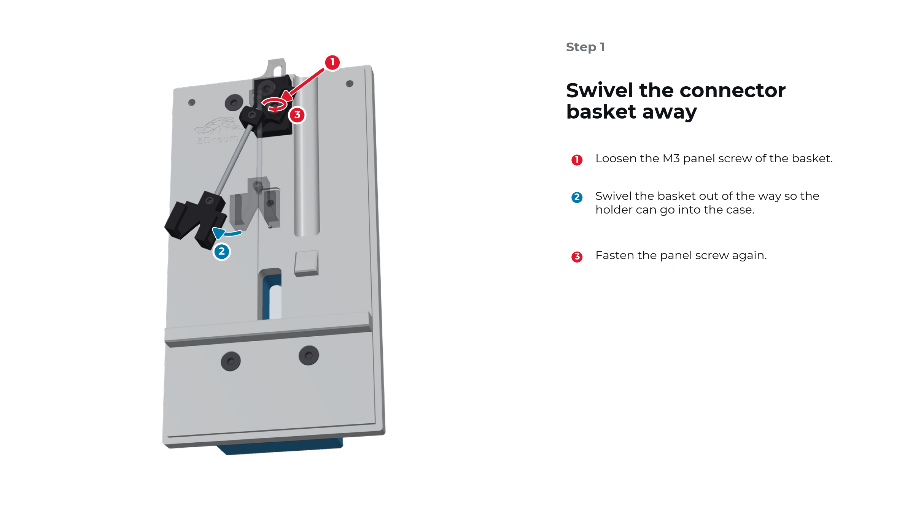
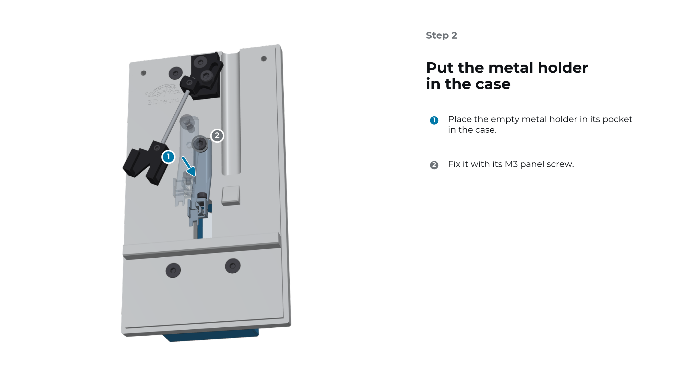
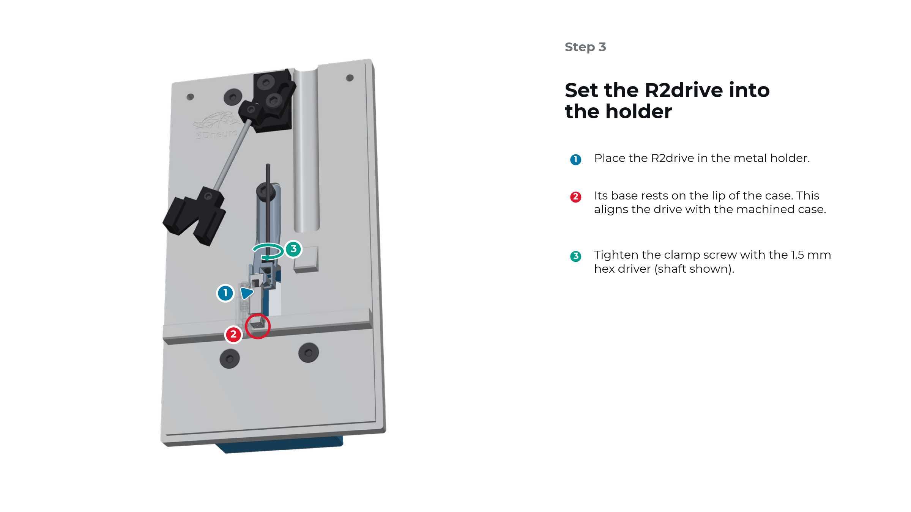
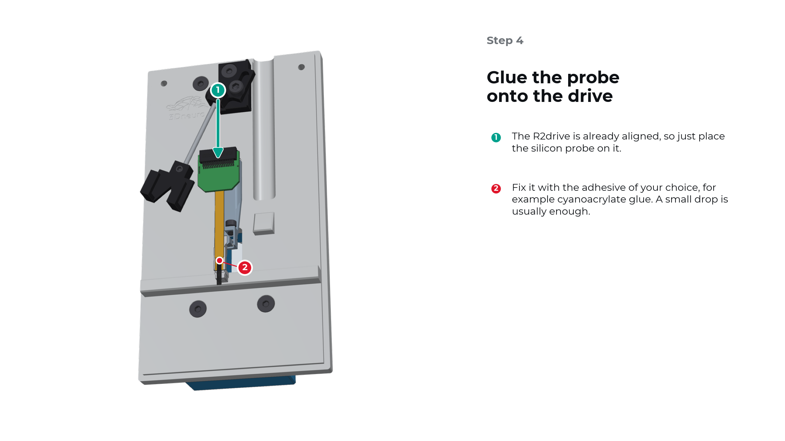
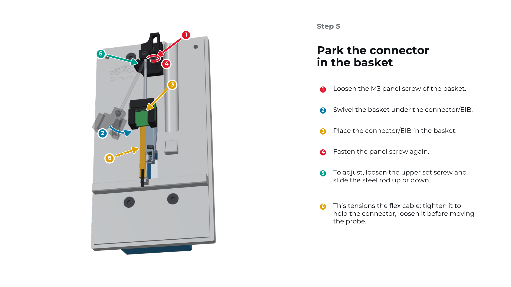
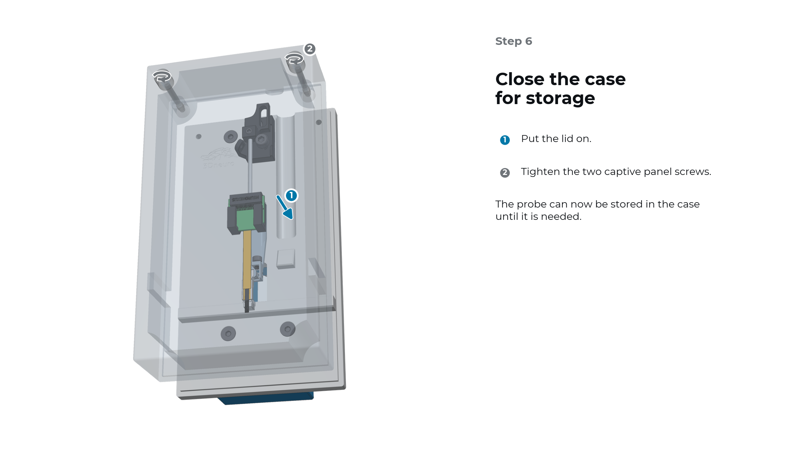

.. _user-manual-metal-load-store:

Load a probe and store it in the case
=====================================

You can load the probe onto the R2drive while the drive sits in the case. The case aligns the drive, so the probe only needs to be placed and glued. At the end, the probe stays in the closed case until you need it.

.. admonition:: You will need

   - R2drive (or R2rail)
   - Metal holder
   - R2 assembly and storage case
   - 1.5 mm hex driver
   - Silicon probe with connector/EIB
   - Adhesive, for example cyanoacrylate glue

Step 1: Swivel the connector basket away
----------------------------------------

#. Loosen the M3 panel screw of the basket.
#. Swivel the basket out of the way so the holder can go into the case.
#. Fasten the panel screw again.

Step 2: Put the metal holder in the case
----------------------------------------

#. Place the empty metal holder in its pocket in the case.
#. Fix it with its M3 panel screw.

.. note::

   You can also attach the R2drive to the holder before inserting it in the case. Pick the version that makes alignment easiest and most reliable for you.

Step 3: Set the R2drive into the holder
---------------------------------------

#. Place the R2drive in the metal holder.
#. Let its base rest on the lip of the case. This aligns the drive with the machined case.
#. Tighten the clamp screw with the 1.5 mm hex driver.

Step 4: Glue the probe onto the drive
-------------------------------------

#. The R2drive is already aligned, so just place the silicon probe on it.
#. Fix the probe with the adhesive of your choice, for example cyanoacrylate glue. A small drop is usually enough.

.. tip::

   Shown here: schematic of a probe with an Omnetics connector. The same steps apply to other probes.

Step 5: Park the connector in the basket
----------------------------------------

#. Loosen the M3 panel screw of the basket.
#. Swivel the basket under the connector/EIB.
#. Place the connector/EIB in the basket.
#. Fasten the panel screw again.
#. To adjust, loosen the upper set screw and slide the steel rod up or down.
#. Use this to tension the flex cable: tight enough to hold the connector, and loosened again before you move the probe.

.. warning::

   Always loosen the flex cable before moving the probe or the connector. A taut flex can pull on the probe.

Step 6: Close the case for storage
----------------------------------

#. Put the lid on.
#. Tighten the two captive panel screws.

The probe can now stay in the case until it is needed. To implant it, continue with :ref:`user-manual-metal-transfer`.
