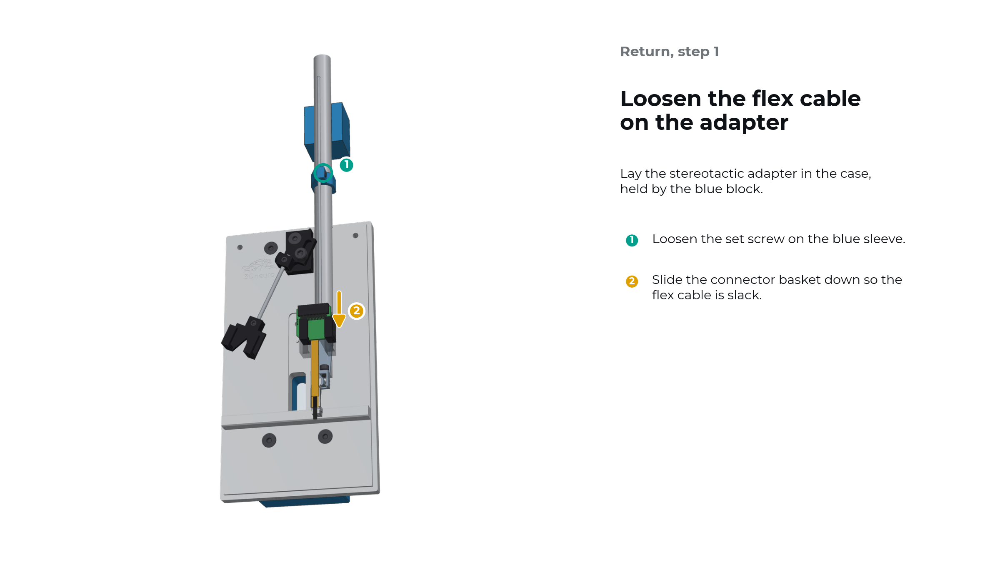
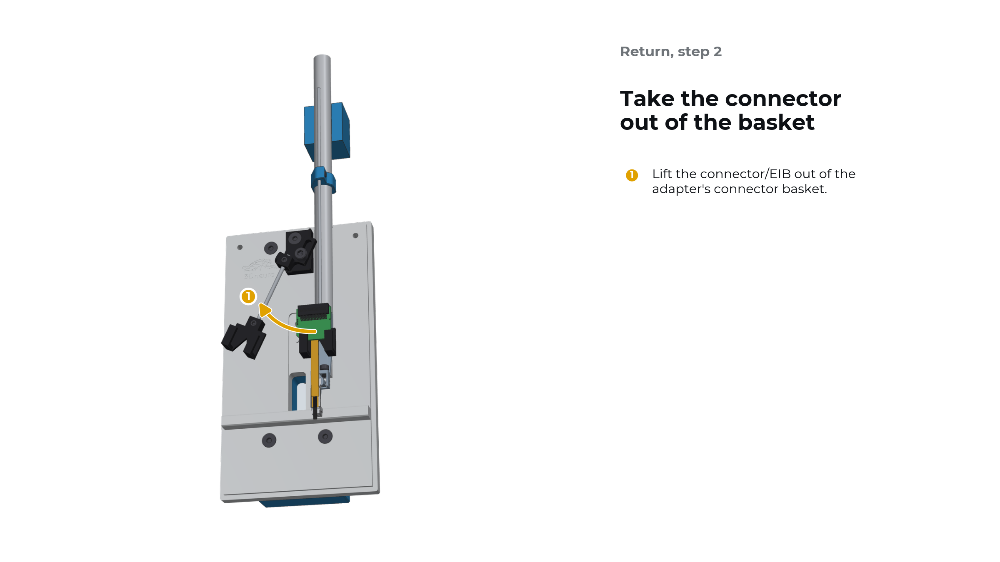
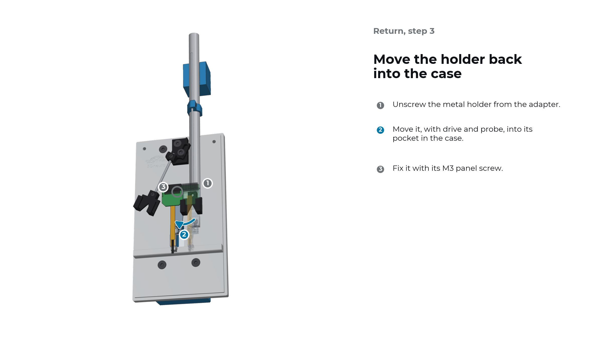
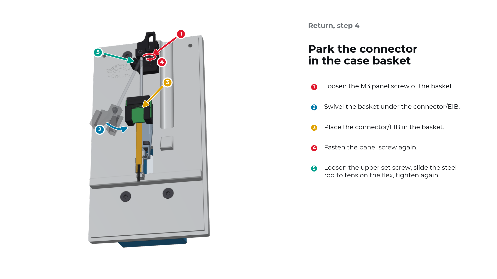
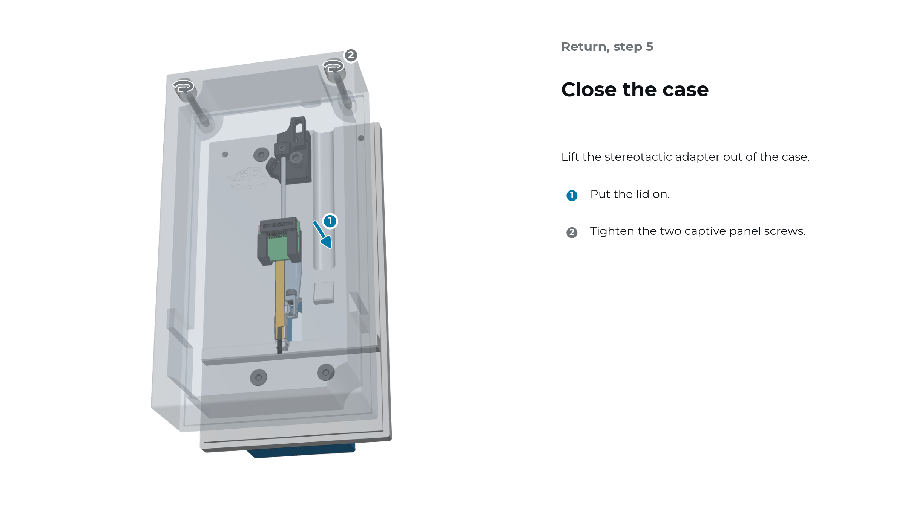

.. _user-manual-metal-return:

Return the drive to the case
============================

After explantation, the holder goes back into the case with drive and probe, ready for clean-up and storage. The adapter lies in the case as in transfer step 2 (see :ref:`user-manual-metal-transfer`).

.. important::

   Before storing the R2drive with a used probe, clean the probe according to the probe manufacturer's protocol.

Step 1: Loosen the flex cable on the adapter
--------------------------------------------

Lay the stereotactic adapter in the case, held by the blue block.

#. Loosen the set screw on the blue sleeve.
#. Slide the connector basket down so the flex cable is slack.

Step 2: Take the connector out of the basket
--------------------------------------------

#. Lift the connector/EIB out of the adapter's connector basket.

Step 3: Move the holder back into the case
------------------------------------------

#. Unscrew the metal holder from the adapter.
#. Move it, with drive and probe, into its pocket in the case.
#. Fix it with its M3 panel screw.

Step 4: Park the connector in the case basket
---------------------------------------------

#. Loosen the M3 panel screw of the basket.
#. Swivel the basket under the connector/EIB.
#. Place the connector/EIB in the basket.
#. Fasten the panel screw again.
#. Loosen the upper set screw, slide the steel rod to tension the flex, and tighten again.

Step 5: Close the case
----------------------

Lift the stereotactic adapter out of the case.

#. Put the lid on.
#. Tighten the two captive panel screws.
