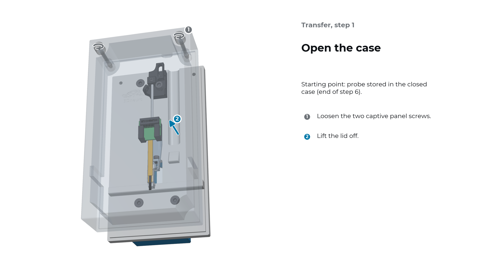
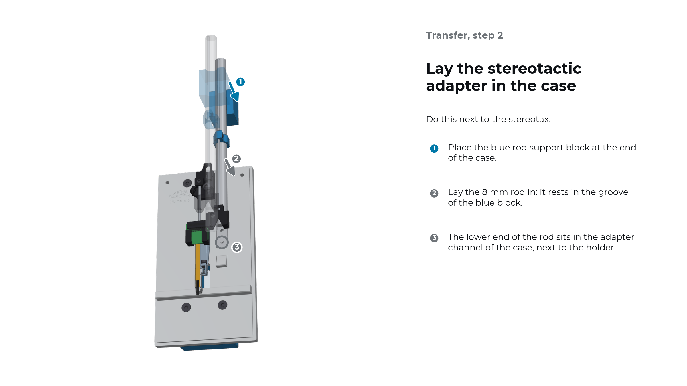
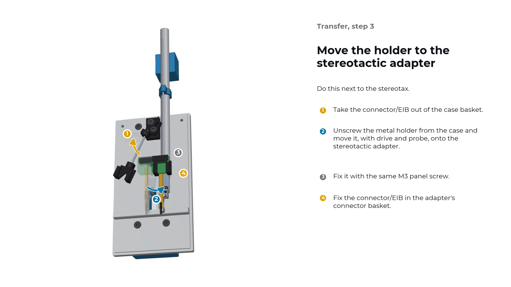
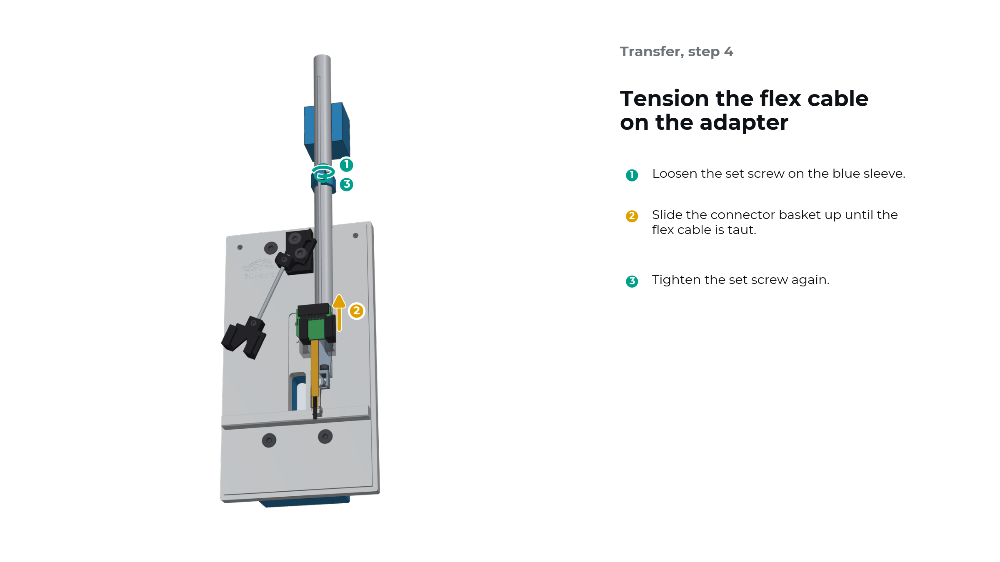
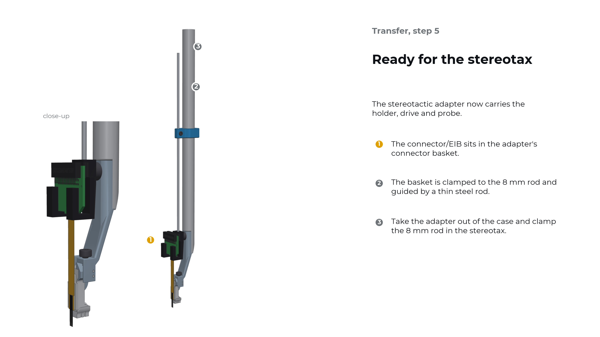
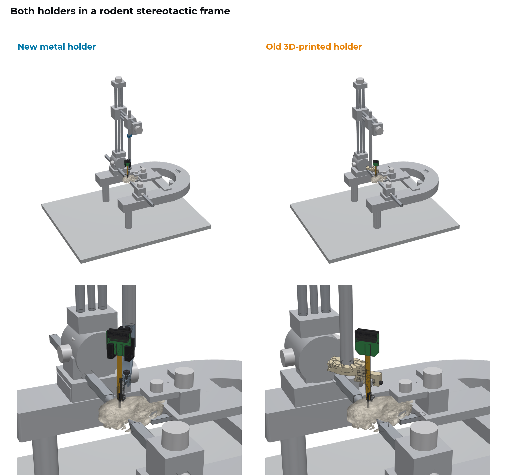

.. _user-manual-metal-transfer:

Move the probe from the case to the stereotax
=============================================

For surgery, the metal holder moves from the case onto the stereotactic adapter, with drive and probe still mounted. The starting point is a probe stored in the closed case (end of step 6 in :ref:`user-manual-metal-load-store`).

.. important::

   Do this next to the stereotactic frame at your surgery setup, so the adapter goes straight from the case into the stereotax.

.. admonition:: You will need

   - The closed case with the loaded probe
   - Stereotactic adapter with connector basket
   - Blue rod support block
   - 1.5 mm hex driver

Step 1: Open the case
---------------------

#. Loosen the two captive panel screws.
#. Lift the lid off.

Step 2: Lay the stereotactic adapter in the case
------------------------------------------------

#. Place the blue rod support block at the end of the case.
#. Lay the 8 mm rod in so that it rests in the groove of the blue block.
#. The lower end of the rod sits in the adapter channel of the case, next to the holder.

Step 3: Move the holder to the stereotactic adapter
---------------------------------------------------

#. Take the connector/EIB out of the case basket.
#. Unscrew the metal holder from the case and move it, with drive and probe, onto the stereotactic adapter.
#. Fix it with the same M3 panel screw.
#. Fix the connector/EIB in the adapter's connector basket.

Step 4: Tension the flex cable on the adapter
---------------------------------------------

#. Loosen the set screw on the blue sleeve.
#. Slide the connector basket up until the flex cable is taut.
#. Tighten the set screw again.

.. note::

   The sleeve set screw does the same job as the upper set screw in the case.

Step 5: Ready for the stereotax
-------------------------------

The stereotactic adapter now carries the holder, drive and probe, with the connector/EIB in its own basket.

#. Take the adapter out of the case.
#. Clamp the 8 mm rod in the stereotax.

In the stereotactic frame
-------------------------

The 8 mm rod clamps where the frame's standard electrode holder would sit. Because the clamp screw is tightened from above, the holder stays clear of ear bars, bite bar and neighbouring implants.

