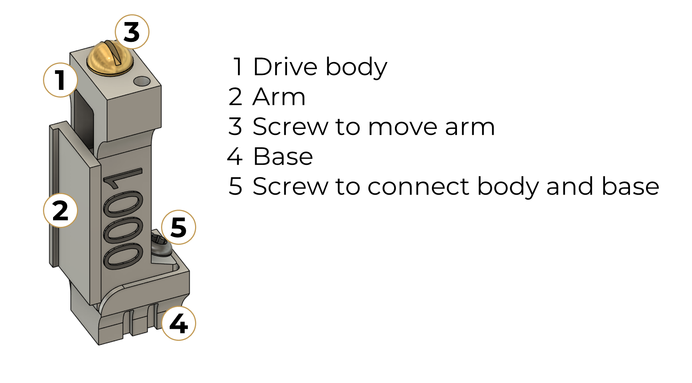
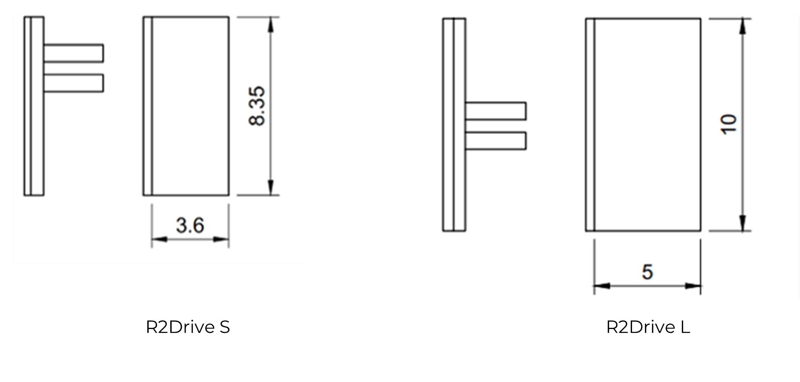
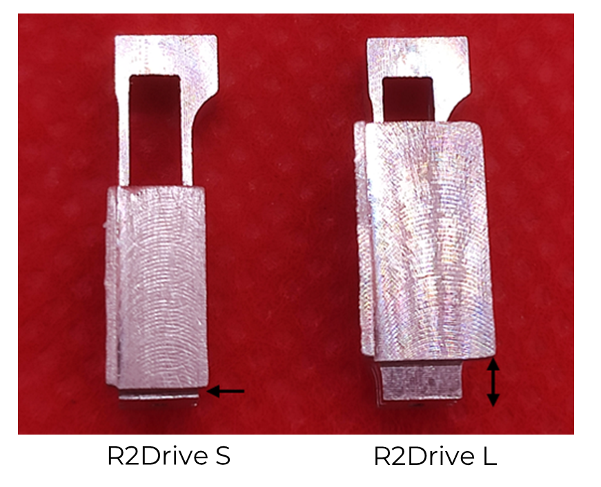
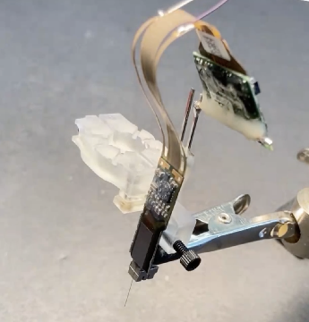
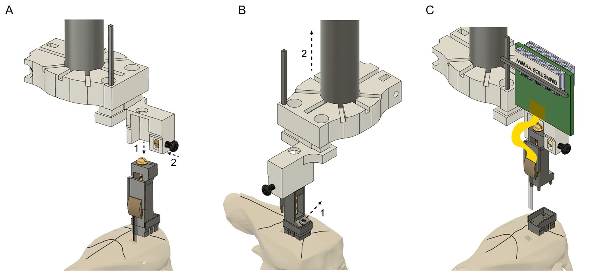

.. _user-manual-r2drive:

R2drive S/L
==========================

.. _user-manual-r2drive-unboxing:

Unboxing
--------

.. _user-manual-r2drive-whats-in-the-box:

What’s in the box?
^^^^^^^^^^^^^^^^^^

Each R2drive is fully assembled and ready to use. Metal pins are included. Below, the main elements of the R2drive are depicted. 

	
   *Components of the R2drive.*
   **1**. R2drive body, compatible with the :doc:`R2 implantation holders </user_manual/implantation_holders/index>`.
   **2**. Moveable arm to attach silicon probes to. Comes in :ref:`two sizes (R2drive S and R2drive L)<user-manual-r2drive-two-versions>`.
   **3**. 00-90 brass screw to move the arm up and down. Resolution per turn: 1/90 inch ~ 282 µM
   **4**. Removable base.
   **5**. Screw to secure the base to the body.
   
In addition to the 5 main elements illustrated above - drive body, arm, base, driving screw and body-base connecting screw - each R2drive features:

* An engraved serial number on the drive body,  
* A protruded edge on one side of the arm that is used to align the probe during the mounting procedure,  
* A 0.8 mm hole near the driving screw head that fits a metal pin of the same diameter.  

.. note::
    The R2drive differs in several ways from the Vöröslakos et al. metal version, including the manufacturing method, choice of material and design features. See :ref:`R2drive assembly guide<assembly-R2drive>` for details.\

.. _user-manual-r2drive-two-versions:

Two versions
^^^^^^^^^^^^

The R2drive comes in 2 versions, differing by arm size: Small (S) will fit most chronic silicon probes, while large (L) will fit the larger probes, including Neuropixels 1.0. The R2drive L arm, while having the same travel distance, does not reach the lowest possible point. Instead it remains about 0.5 mm above the base bottom,  to accommodate the typically longer probe shanks for this type of probes (e.g. 10-mm long shank for NP 1.0 probes).

.. _user-manual-r2drive-features:

R2drive features
^^^^^^^^^^^^^^^^

.. list-table::
   :widths: 30 70
   :header-rows: 0

   * - Material
     - Aluminium (main parts), stainless steel and brass (screws)
   * - Footprint (mm)
     - 3.3 x 4.45 (w x d, base only); 4 x 5 (w x d, including arm)
   * - Weight (g)
     - 0.47
   * - Travel distance (mm)
     - +/- 6.5
   * - Travel per screw turn (µm)
     - 282 (=1/90 inch)
   * - Arm size (mm)
     - S: 3.6 x 8.35 (w x h)
       L: 5 x 10 (w x h)

Regarding the travel distance, the 7 mm mentioned in Vöröslakos et al. 2021 is the maximum theoretical travel distance. Manufacturing processes such as soldering or welding will reduce that distance by 0.5 to 1 mm.

.. _user-manual-r2drive-before-use:

Before (first) use
------------------

For each drive, please do the following checks:

* Test the base/body separation.
* Test the drive shuttle movement.
* Seal the bottom of the base.
* (optional) Test the metal pin

Below we describe in more detail each check.

(1) For the base/body, sometimes the fit is a bit tight due to variability in the production process. To get a feel for it before use can help with probe recovery later on. Simply unfasten the screw and test if the drive body and base separate easily. If you have additional bases you want to use with the drive, we recommend a quick check of those as well.  

(2) For the shuttle movement: It should be smooth. We apply mineral oil onto the screw and shuttle prior to quality control and packaging. But any kind of lubrication can deteriorate over time. If you handle the drive in a way that removes the mineral oil (e.g. sterilization in alcohol) or if the movement is not smooth, consider adding a drop of mineral oil on the drive screw and the gap between nut and drive body to restore smooth movement.  

(3) The **bottom of the base needs to be sealed**. Indeed, when left open, either dental cement or fluids might seep into the hole at the bottom and dry up post-implantation. This will likely impede the movement of the screw attaching the body to the base, and as a result, make probe recovery difficult. As a sealant, playdough works well when covered with a fine layer of dental cement (see procedure in `drive assembly video <https://buzsakilab.github.io/3d_print_designs/microdrives/metal-microdrive/>`__, starting at 1 min 57s).  

(4) Attaching a metal pin to the microdrive may be convenient in some cases. The R2drive features a round 0.8 mm hole on the top that can hold a 0.8 mm dowel pin. The pin can hold for example an Omnetics connector. The hole on some drives can be quite tight – make sure the pin fits before loading an electrode. If it is too tight, you can enlarge it with a 0.8 mm (or 1/32 inch) drill. As the drive body is made of aluminum, soldering the pin to the body is difficult. Instead, use glue or a small amount of dental cement, which can be removed during surgery by melting it away (with a soldering iron or any other heated metal, e.g., tweezers heated up in a hot bead sterilizer).

.. _user-manual-r2drive-attaching-probe:

Attaching your probe to the R2drive
-----------------------------------

A method to attach Neuropixels probes (or any other silicon probe) is available `here <https://www.youtube.com/watch?v=MpPdWJEo7Fo>`__. Another method for a regular silicon probe (Cambridge Neurotech H2) is available in the methods paper by `Schröder et al. 2024 <https://app.jove.com/t/66867/the-dream-implant-lightweight-modular-cost-effective-implant-system#summary>`__ (starts at 2 min 02 sec in the `video <https://dx.doi.org/10.3791/66867-v>`__). For another perspective, see this `video <https://www.youtube.com/watch?v=2L5RHcbsU7o>`__ (informative even if a plastic microdrive is used in the end). 

Neuropixels 1.0 probe mounted on the R2drive (`source <https://www.youtube.com/watch?v=MpPdWJEo7Fo>`__)

.. _user-manual-r2drive-implantation-explantation:

Implantation/explantation protocol
----------------------------------

After the following 3 steps have been completed: 

#. Probe is mounted on the R2drive,
#. The R2drive is connected to your stereotax through the drive holder,
#. The probe connector is secured by means of soldering or other.

Then, probe implantation becomes a standard procedure. A full surgery protocol using the R2drive and holder is available `here <https://dx.doi.org/10.3791/66867-v>`__ (the R2 cap system is not used in this protocol, see headgear section for mouse/rat cap implantation).

Explantation, or probe recovery, is relatively  straightforward. See Figure 4 `here <https://elifesciences.org/articles/65859/figures#content>`__. In addition to the schematic (reproduced below), that figure includes two supplementary videos showing silicon probe recovery with the mouse cap and the rat cap, respectively. **The critical step for this procedure is precise alignment of the holder with the drive**, to avoid tissue damage and to prevent breaking the shanks when retracting the probe. The `protocol <https://elifesciences.org/articles/65859>`__ further recommends to "carefully monitor the shanks of the probe under a microscope during the entire recovery procedure and, if any unexpected movement of the probe is observed, return to the previous step to make sure that everything is secured properly". 

   
   Illustration of the probe explantation process. 
   Image from `eLife article <https://elifesciences.org/articles/65859#fig2>`__, under CC BY 4.0 license.

.. _user-manual-r2drive-probe-cleaning:

Probe cleaning for reuse
------------------------

While the recovered probes remain mounted onto the R2drive, cleaning can be done by lowering the probe into various solutions depending on the probe type. 

.. warning::
   Treat the following cleaning procedures are suggestions only. Always verify for your individual type of silicon probe, application and local regulations whether your cleaning protocol is appropriate.
  

.. _user-manual-r2drive-cleaning-regular-silicon-probes:

Regular silicon probes
^^^^^^^^^^^^^^^^^^^^^^

Rinse in: 

#. Distilled water,
#. Contact lens solution (containing protease),
#. Distilled water again.

Each washing step should last for at least 12 hr. Soak the probe shanks only. If extra tissue or debris is detected between the shanks, it can be carefully removed with a fine needle (26 gauge or smaller) under a microscope. 

.. _user-manual-r2drive-cleaning-neuropixels-1-0-probes:

Neuropixels 1.0 probes
^^^^^^^^^^^^^^^^^^^^^^

Soak the probe shank in 1% tergazyme (Alconox) for 24–48 hr, then rinse in distilled water and isopropyl alcohol (see `Luo et al., 2020 <https://elifesciences.org/articles/59716>`__).

