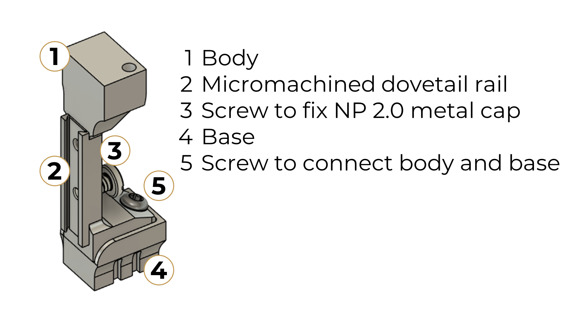

.. _user-manual-r2rail:

R2rail
====================

The R2rail currently comes in one version: **R2rail 2.0**, for chronic recordings with Neuropixels 2 probes equipped with the dovetail caps (R2rail 1.0 for NPX 1 probes coming soon). 

It features micromachined rails to easily attach and secure the probes, similar to the official holders for acute insertions.

   *Components of the R2rail.*
   **1**. R2rail body, compatible with the :doc:`R2 implantation holders </user_manual/implantation_holders/index>`.
   **2**. Micromachined dovetail rail to directly connect Neuropixels 2.0 metal caps.
   **3**. M1 screw for fastening the Neuropixels metal cap to the dovetail rail. The two tapped holes on the R2rail body allow variation on how the probe is secured.
   **4**. Removable base.
   **5**. Screw to secure the base to the body.

The R2rail is fully compatible with our R2 ecosystem – it features the same, proven base that enables stable long-term chronic implantation and easy probe recovery, and is compatible with the R2 implantation holders. As a result, except for attaching the probe (see below), all other procedures are the same as with the R2drive. 

.. _user-manual-r2rail-attaching-probe:

Attaching and removing your probe
---------------------------------
To get a feeling on how to attach or remove a probe, you can look at the steps described in :ref:`attaching your probe to the R2drive<user-manual-r2drive-attaching-probe>`.
It is possible to attach a Neuropixels 2.0 probe to the R2rail without the use of extra tools. The videos below illustrate attachment and removal of probes.

.. _user-manual-r2rail-attachment:

Attachment
^^^^^^^^^^

.. attention::

   This video only emulates the attachment process. It is actually the removal video below, played backwards, due to limitations we had when
   filming. We will update this section with actual attachment sequences in the near future.

.. raw:: html

   <iframe width="560" height="315" src="https://www.youtube.com/embed/vkdxY-Ig_YU" title="Attaching probe to R2rail" frameborder="0" allow="accelerometer; autoplay; clipboard-write; encrypted-media; gyroscope; picture-in-picture" allowfullscreen></iframe>

.. _user-manual-r2rail-removal:

Removal
^^^^^^^

.. raw:: html

   <iframe width="560" height="315" src="https://youtube.com/embed/Vq41W80wJkg" title="Probe removal from R2rail" frameborder="0" allow="accelerometer; autoplay; clipboard-write; encrypted-media; gyroscope; picture-in-picture" allowfullscreen></iframe>

.. _user-manual-r2rail-probe-cleaning:

Probe cleaning
--------------

For instructions on how to clean your probe before reuse, see the section on :ref:`Probe cleaning for reuse <user-manual-r2drive-probe-cleaning>` in the R2drive manual.

